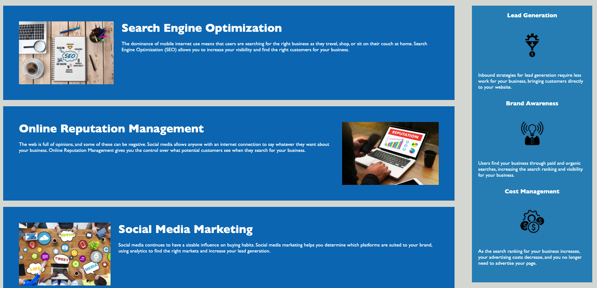

# Horiseon Code Refactor

For this assignment we were provided starter code in which we had to refactor to provide better accessibility, semantics, and consolidate CSS as well as organized to follow semantic structure.

## Screenshot Description

Screenshots below show the refactored page uploaded in Git Page:

- Screenshot 1

1. Displaying the header
2. Navigation which has been updated and is now functional
3. hero image

- Screenshot 2

1. Displays the main section which I have broken down into specific article section for readability well as the benefits section
2. Both Sections have had their CSS updated and condensed
3. Img tags were given alt attributes.

